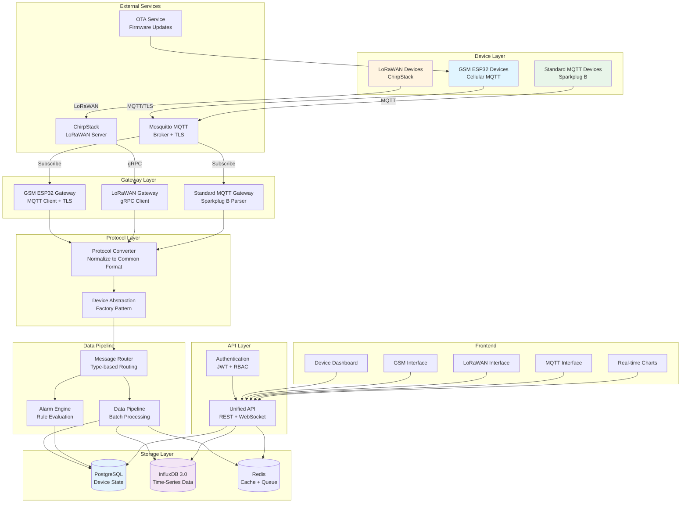
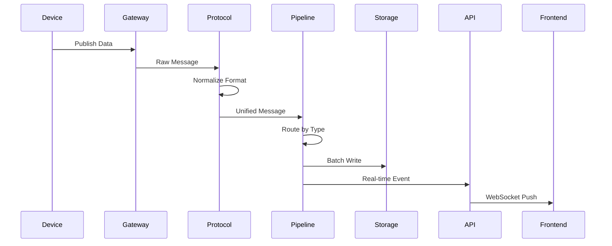
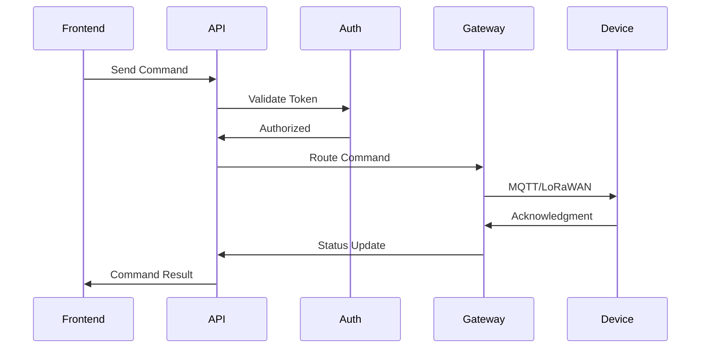

# WebSCADA System Architecture

## System Overview

## Component Details

### 1. Device Layer

**GSM ESP32 Devices:**

- Cellular connectivity (2G/3G/4G)
- MQTT over TLS
- JSON payloads (Sparkplug B compatible)
- OTA firmware updates
- Deep sleep power management

**LoRaWAN Devices:**

- Long-range, low-power communication
- ChirpStack managed
- OTAA/ABP activation
- End-to-end encryption
- Payload decoders

**Standard MQTT Devices:**

- Direct MQTT connection
- Sparkplug B protocol
- QoS 0/1/2 support
- Retained messages
- Last will testament

### 2. Gateway Layer

**GSM ESP32 Gateway:**

- MQTT client with auto-reconnect
- TLS 1.2+ encryption
- Offline message buffering
- Device lifecycle management
- Signal strength monitoring

**LoRaWAN Gateway:**

- ChirpStack gRPC integration
- Device provisioning (OTAA/ABP)
- Multi-decoder support
- Uplink/downlink handling
- Gateway status monitoring

**Standard MQTT Gateway:**

- Sparkplug B parser
- Topic-based routing
- Auto-discovery
- QoS management
- Session persistence

### 3. Protocol Layer

**Protocol Converter:**

- Normalizes all 3 device types to unified format
- Handles different payload structures
- Validates data integrity
- Enriches with metadata

**Device Abstraction:**

- Factory pattern for device creation
- Unified interface for all device types
- Dependency injection
- Lifecycle management

### 4. Data Pipeline

**Message Router:**

- Type-based message routing
- Priority queuing
- Load balancing
- Error handling

**Data Pipeline:**

- Batch writes to InfluxDB (10k points/sec)
- State updates to PostgreSQL
- Real-time WebSocket broadcasting
- <100ms latency target

**Alarm Engine:**

- Configurable alarm rules
- Real-time evaluation
- Priority levels
- Notification system

### 5. Storage Layer

**PostgreSQL:**

- Device metadata and configuration
- User accounts and permissions
- Alarm definitions and history
- Device connection logs

**InfluxDB 3.0:**

- Time-series telemetry data
- Device health metrics
- Alarm events
- Analytics aggregations

**Redis:**

- Session storage
- Message queue
- Real-time cache
- Pub/sub for WebSocket

### 6. API Layer

**Unified API:**

- RESTful endpoints
- WebSocket for real-time
- Rate limiting
- Request validation (Zod)

**Authentication:**

- JWT tokens
- Role-based access control (RBAC)
- API key management
- Device authentication

## Data Flow

### Telemetry Data Flow

### Command Flow

## Performance Targets

| Metric                | Target | Current |
| --------------------- | ------ | ------- |
| GSM ESP32 Devices     | 1000+  | -       |
| LoRaWAN Devices       | 5000+  | -       |
| Standard MQTT Devices | 2000+  | -       |
| Pipeline Latency      | <100ms | -       |
| API Response Time     | <500ms | -       |
| Message Delivery      | 99.9%  | -       |
| Tag Support           | 100k+  | -       |
| Real-time Updates     | <1s    | -       |

## Security Architecture

### IEC 62443 Compliance

**Zone Segmentation:**

- Level 0: Device Layer (isolated networks)
- Level 1: Gateway Layer (DMZ)
- Level 2: Application Layer (internal network)
- Level 3: Enterprise Layer (user access)

**Security Controls:**

- TLS 1.2+ for all MQTT connections
- End-to-end LoRaWAN encryption
- JWT authentication with refresh tokens
- RBAC with principle of least privilege
- Device certificate management
- Audit logging (all operations)
- SQL injection prevention (Zod validation)
- XSS protection (Content Security Policy)
- Rate limiting (per device type)
- Intrusion detection

## Scalability

### Horizontal Scaling

- Gateway services: Stateless, scale to N instances
- Data pipeline: Queue-based, parallel processing
- API layer: Load balanced across instances
- InfluxDB: Clustered deployment
- PostgreSQL: Read replicas

### Vertical Scaling

- Batch sizes configurable
- Worker thread pools
- Connection pooling
- Memory-efficient streaming

## Monitoring & Observability

- Prometheus metrics export
- Grafana dashboards
- Device health monitoring
- Gateway status tracking
- Pipeline throughput metrics
- Alarm rate monitoring
- API performance tracking
- Error rate alerts

## Disaster Recovery

- PostgreSQL: Daily backups + WAL archiving
- InfluxDB: Snapshot backups every 6 hours
- Redis: AOF persistence
- Configuration versioning
- Blue-green deployments
- Automated failover
- Data retention policies

## Technology Stack

**Backend:**

- Node.js 20 LTS
- TypeScript 5.3+
- Fastify 4.x
- MQTT.js 5.x
- Sparkplug B protocol
- ChirpStack gRPC client

**Frontend:**

- Next.js 14 (App Router)
- React 18
- TypeScript 5.3+
- Tailwind CSS
- Recharts/D3.js
- Socket.IO client

**Databases:**

- PostgreSQL 16
- InfluxDB 3.0
- Redis 7

**Infrastructure:**

- Docker
- Docker Compose
- Mosquitto MQTT
- ChirpStack LoRaWAN Server

**Firmware:**

- ESP32 (Arduino/ESP-IDF)
- GSM modem libraries
- MQTT client
- TLS support
